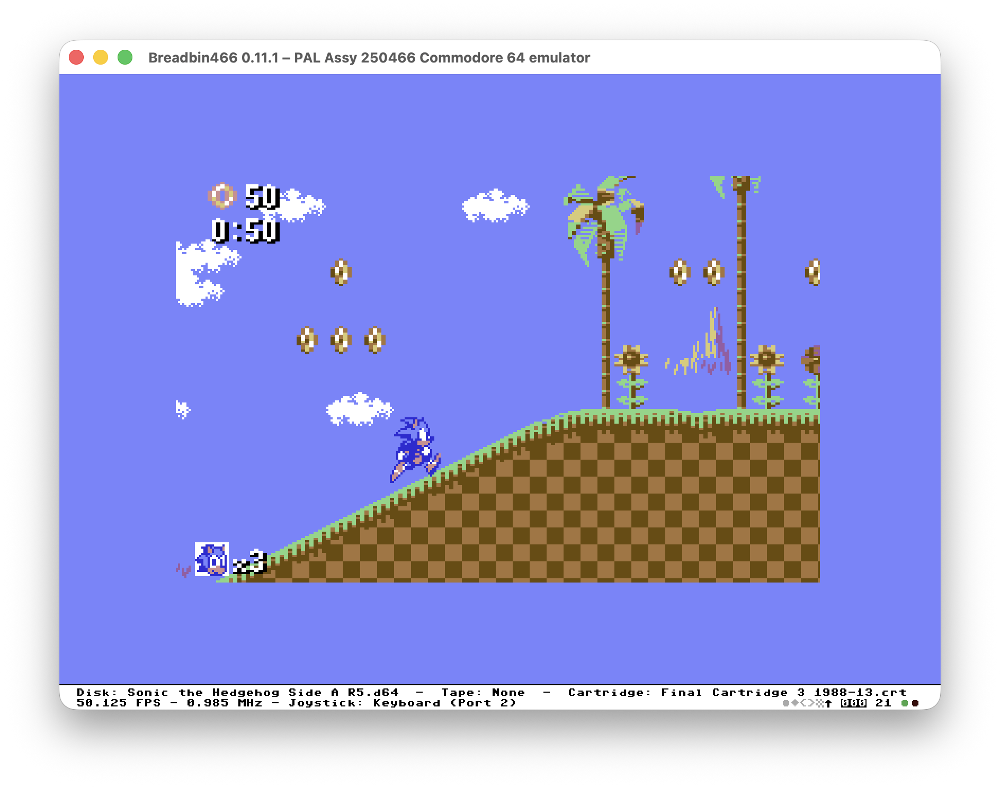
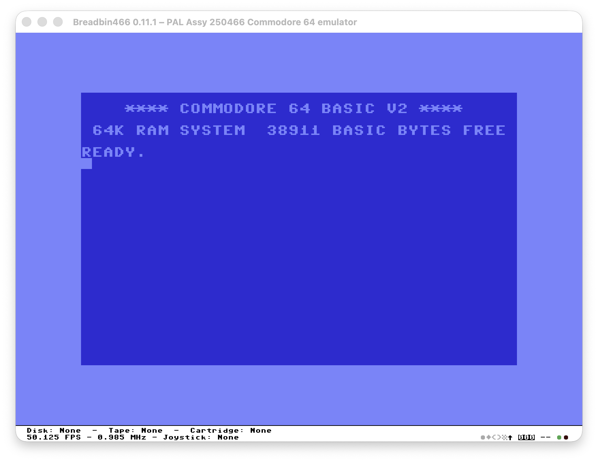

# Breadbin466

Breadbin466 is a from-scratch Commodore 64 emulator written in Rust.

Its purpose is to reproduce one clearly defined machine as faithfully as possible:

- Commodore 64 PAL;
- Assy 250466 motherboard;
- MOS Technology 6510 CPU;
- MOS Technology 6569R5 VIC-II;
- MOS Technology 6581R4AR SID;
- two MOS Technology 6526A CIA chips;
- Commodore 1541 disk drive;
- Commodore 1530 Datassette;
- Commodore 1764 REU with 512 KB.

Rather than combining many hardware revisions, regional models and convenience-oriented shortcuts, Breadbin466 concentrates on a single representative Commodore 64 configuration.

The source tree is intended to remain understandable as an engineering description of the emulated machine, not merely as code that happens to run Commodore 64 software.

## Current scope

The project includes emulation of the principal components of the reference machine, including:

- CPU and motherboard memory mapping;
- VIC-II video and bus arbitration;
- 6581R4AR SID audio;
- CIA timers, interrupts, keyboard and joystick interfaces;
- IEC serial bus;
- cycle-driven Commodore 1541;
- Commodore 1530 Datassette;
- cartridge support, including EasyFlash and freezer cartridges;
- Commodore 1764 REU;
- D64, G64, NIB and NBZ disk images;
- an integrated debugger for inspecting the emulated machine.

## Project status

Breadbin466 is under active development.

A wide range of games, demos, fastloaders, copy-protected disk images, cartridges and REU software already run, but the project should not yet be considered finished. Hardware fidelity is improved continuously as behaviours are documented, tested and understood more precisely.

Bug reports are most useful when they include:

- the exact software version or image used;
- the steps required to reproduce the issue;
- the expected behaviour on real hardware, when known;
- relevant screenshots or debugger output;
- whether the issue also occurs without optional hardware such as a cartridge or REU.